# Examen Práctico Unidad 2  
**Asignatura:** Desarrollo Móvil Integral  
**Proyecto:** Aplicación *Cinemapedia*  

---

##  1. Contexto
<p align="justify">
El proyecto <strong>Cinemapedia</strong> es una aplicación móvil desarrollada en <strong>Flutter</strong> con el objetivo de aprender y practicar el consumo de <strong>APIs</strong>. La aplicación permite mostrar información actualizada sobre películas en cartelera, próximas a estrenarse, populares, mejor calificadas y mexicanas, obtenidas desde una API externa.  

Actualmente, se está implementando esta misma funcionalidad para <strong>series</strong>, permitiendo consultar y visualizar contenido televisivo con una estructura similar a la de las películas.
</p>

---

##  2. Información General del Estudiante
- **Nombre completo:** Jaime Vazquez Santiago 
- **Matrícula:**  220031 
- **Grupo:** B  
- **Repositorio privado:** [https://github.com/Jaimevs/DMI_ExamenPractico_U2_220031](#)  
- **Versión actual:** `v1.0-examen`  
- **Último commit registrado:**  

## 3. Actividades Desarrolladas Durante la Contingencia

| Fecha | Actividad | Descripción breve | Evidencia | Commit ID |
|:------|:-----------|:------------------|:-----------|:-----------|
| 08/11/2025 | Creación del repositorio | Se cargó la práctica base y se configuró la API TMDB. | 743ce1f (HEAD -> main, origin/main) first commit | 743ce1f |
| 09/11/2025 | Implementación del Splash Screen | Se creó la carpeta `audio` y dentro de `screens/splash` se agregó `splash_screen.dart` usando `just_audio` para animación y audio. | d977227 ExamenPractico | d977227 |
| 10/11/2025 | Pantalla de carga progresiva | Se añadió un indicador de carga animado que muestra el progreso mientras se cargan los providers. | bbc3ead ExamenPractico | bbc3ead |
| 11/11/2025 | Ajustes visuales en Swiper | Se agregó clasificación visual y detalles en el carrusel de películas. | aa2c15b ExamenPractico | aa2c15b |
| 11/11/2025 | Personalización del ícono de la app | Se reemplazó el ícono predeterminado por uno personalizado usando `flutter_launcher_icons`. | d80c8e9 ExamenPractico | d80c8e9 |
| 17/11/2025 | Ajustes en Películas Actuales | Se agregó **fecha dinámica actual** (día de la semana, día y mes) en la sección *Now Playing*. | f5106d3 feat: mejorar secciones de películas | f5106d3 |
| 17/11/2025 | Ajustes en Próximos Estrenos | Se filtraron los *Upcoming* para mostrar solo los del mes y año vigentes y se sustituyó popularidad y promedio por la **fecha de estreno**. | f5106d3 feat: mejorar secciones de películas | f5106d3 |
| 17/11/2025 | Ajustes en Películas Populares | Se eliminó el subtítulo de la sección *Popular*. | f5106d3 feat: mejorar secciones de películas | f5106d3 |
| 17/11/2025 | Ordenamiento de Películas Mexicanas | Se ordenaron las películas mexicanas por **fecha de estreno descendente**. | f5106d3 feat: mejorar secciones de películas | f5106d3 |
| 17/11/2025 | Implementación del módulo de Series | Se agregó la arquitectura completa: entidad Series, datasources, repositorios, modelos, mappers, providers, listas y Swiper. | 47ebaea feat: implementar módulo de Series | 47ebaea |
| 17/11/2025 | Estructura para Series (Domain + Infra) | Se agregó capa *domain* e *infrastructure* para manejar series en la misma arquitectura que películas. | 934748b feat: agregar capa domain para Series | 934748b |
| 17/11/2025 | Pantallas de detalle (Series y Películas) | Se implementaron pantallas completas de detalle: información, géneros, sinopsis, actores, animaciones, providers por ID. | 356a09a feat: agregar pantallas de detalle | 356a09a |


<p align="center">
  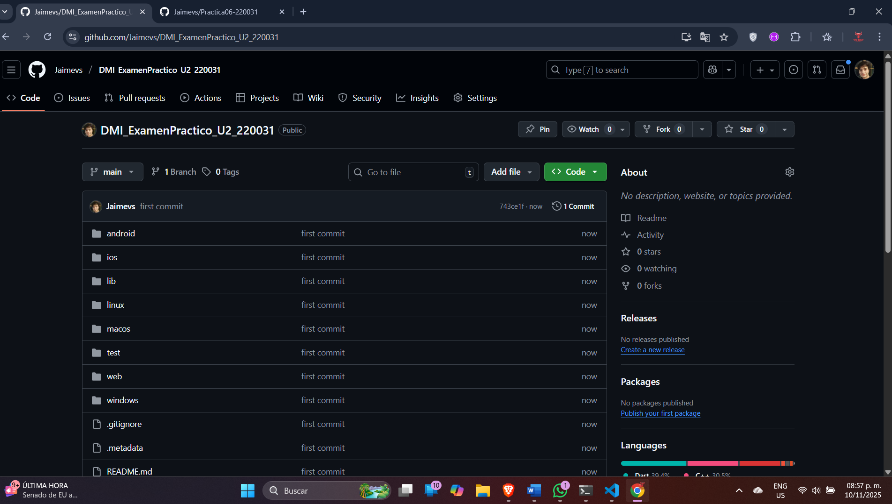<br>
  <em><strong>Figura 1:</strong> Evidencia de la creación del repositorio en GitHub</em>
</p>

<p align="center">
  <br>
  <em><strong>Figura 2:</strong> Evidencia de la personalización del ícono en la app Flutter.</em>
</p>

<div style="display: flex; justify-content: center; gap: 20px;">
  <div style="text-align: center;">
    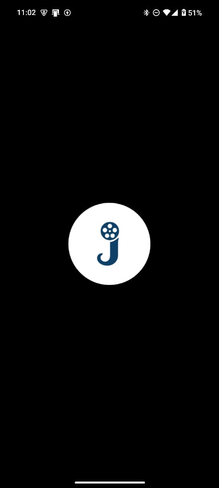<br>
    <em><strong>Figura 3:</strong> Pantalla de carga inicial con el logo de la app.</em>
  </div>

  <div style="text-align: center;">
    <br>
    <em><strong>Figura 4:</strong> Animación con audio en el Splash Screen usando `just_audio`.</em>
  </div>
</div>

<div style="display: flex; justify-content: center; gap: 20px;">
  <div style="text-align: center;">
    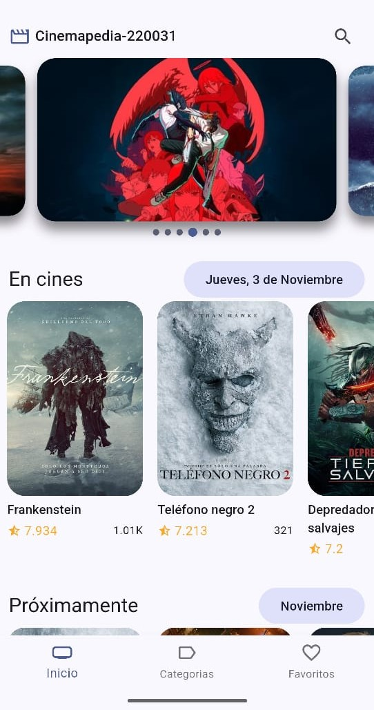<br>
    <em><strong>Figura 5:</strong> Carrusel de películas antes de agregar clasificación visual y detalles.</em>
  </div>

  <div style="text-align: center;">
    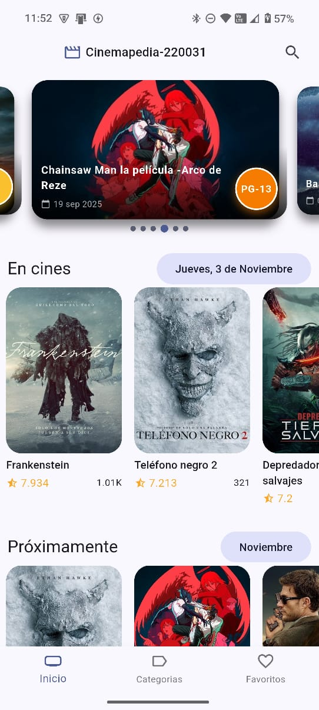<br>
    <em><strong>Figura 6:</strong> Carrusel de películas después de agregar clasificación visual y detalles con píldora de color.</em>
  </div>
</div>

<p align="center">
  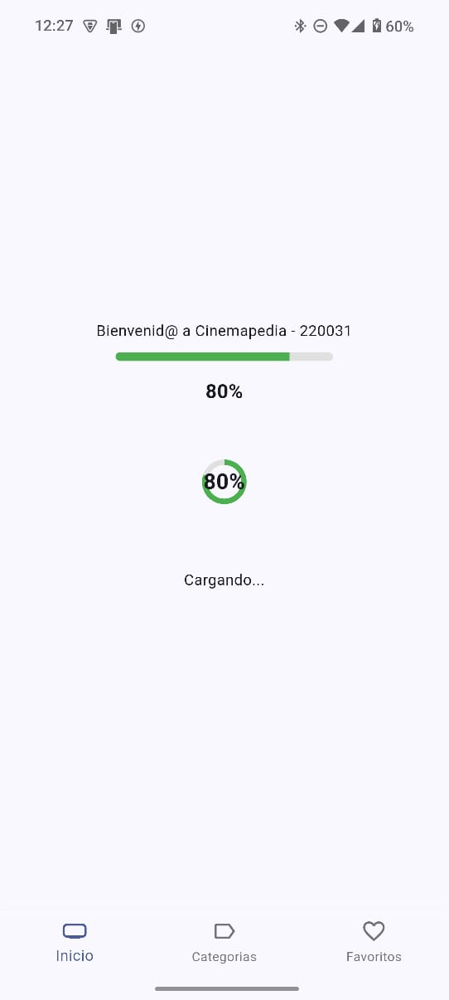<br>
  <em><strong>Figura 7:</strong> Indicador de carga animado durante la inicialización de la app.</em>
</p>

<p align="center">
  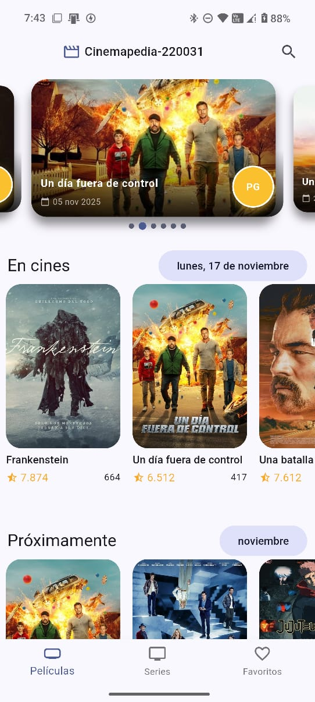<br>
  <em><strong>Figura 8:</strong> Películas actuales mostrando la fecha dinámica del dispositivo.</em>
</p>

<p align="center">
  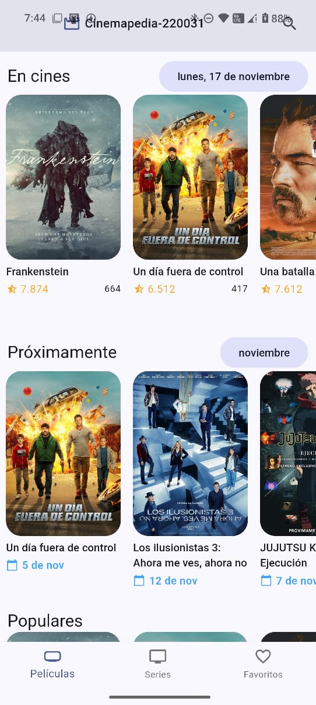<br>
  <em><strong>Figura 9:</strong> Sección 'Upcoming' mostrando solo estrenos del mes y año vigentes.</em>
</p>

<p align="center">
  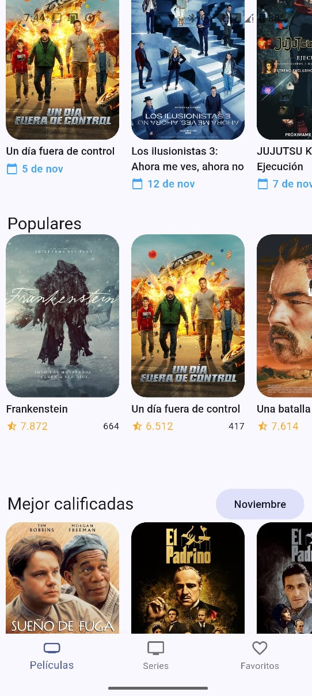<br>
  <em><strong>Figura 10:</strong> Películas populares sin subtítulo adicional en la sección.</em>
</p>

<p align="center">
  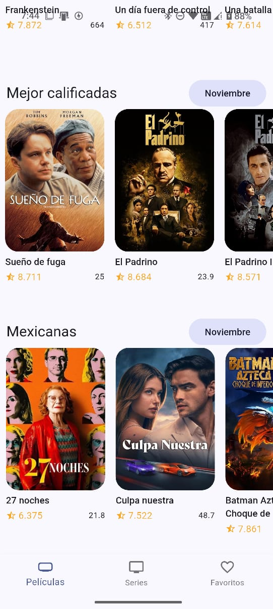<br>
  <em><strong>Figura 11:</strong> Películas mexicanas ordenadas por fecha de estreno descendente.</em>
</p>

<p align="center">
  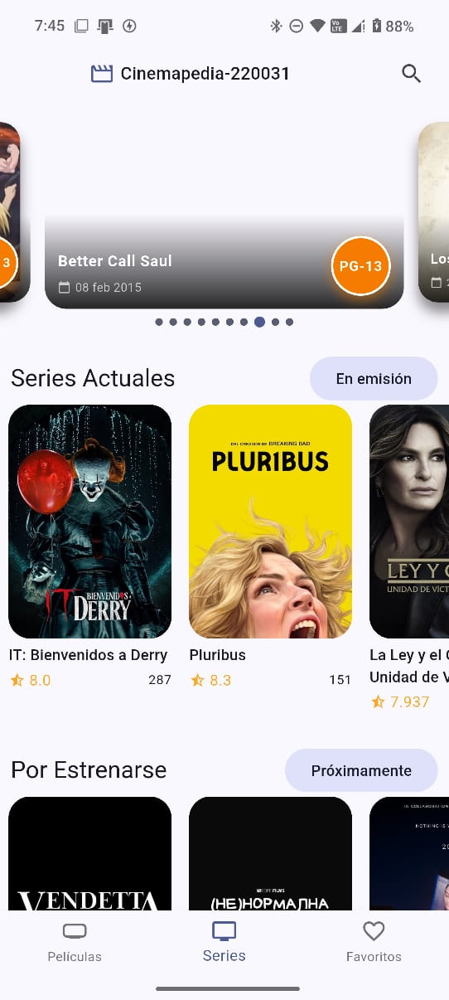<br>
  <em><strong>Figura 12:</strong> Swiper con el Top 10 de series.</em>
</p>

<p align="center">
  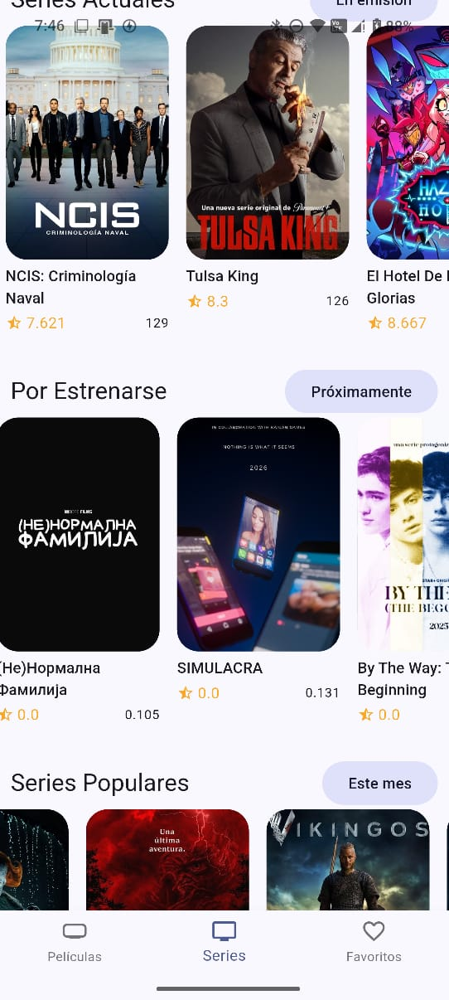<br>
  <em><strong>Figura 13:</strong> Listas infinitas de Series Actuales, Próximas, Populares y Mejor Valoradas.</em>
</p>

<p align="center">
  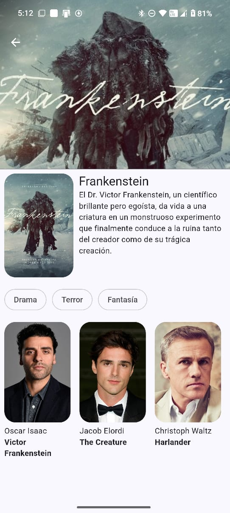<br>
  <em><strong>Figura 14:</strong> Pantalla de detalles con géneros, sinopsis, actores y diseño avanzado.</em>
</p>


---

## 💾 4. Historial de Commits Relevantes
> Puedes obtenerlos con el comando:
> ```bash
> git log --oneline
> ```

| Commit | Mensaje | Fecha |
|:--------|:----------|:-------|
| `12f3a4b` | feat: agregar splash animado con audio | 09/11/2025 |
| `9e8d7c6` | feat: implementar loading progresivo | 10/11/2025 |
| `5d4c3b2` | fix: sombreado de Swiper y píldora de clasificación | 11/11/2025 |
| `1a2b3c4` | refactor: separar providers de películas y series | 12/11/2025 |

> 🔹 *Incluye mínimo 4 commits representativos, con mensajes claros y semánticos.*

---

## 🖼️ 5. Evidencias Visuales
Las siguientes capturas se almacenan en la carpeta `docs/screenshots/` o `assets/screenshots/` del repositorio.

| Evidencia | Descripción | Imagen |
|:------------|:-------------|:--------|
| Splash Screen | Animación inicial con logo y sonido |  |
| Loading Screen | Indicador porcentual de carga |  |
| Swiper Principal | Muestra título, fecha y clasificación |  |
| Now Playing | Muestra la fecha dinámica actual |  |

> 📌 *Asegúrate de subir las imágenes al repositorio antes de referenciarlas.*

---

## 🤖 6. Uso de Inteligencia Artificial
Durante el desarrollo autónomo se empleó apoyo asistido de IA generativa para:

- Consultar ejemplos de obtención de clasificación de películas desde TMDB.  
- Generar funciones de formateo de fechas con `intl`.  
- Solicitar sugerencias de estilo para la barra de progreso y el Swiper.  
- Redactar documentación técnica.

Toda la evidencia de prompts y resultados se encuentra en el documento `Prompts.pdf` incluido en el repositorio.

---

## 🧭 7. Próximas Acciones
- [ ] Integrar animación con Lottie en el Splash.  
- [ ] Completar la sección de Series Populares.  
- [ ] Documentar dependencias nuevas en el README.  
- [ ] Grabar video corto mostrando la aplicación funcional.  

> 🔹 *Marca con “✔️” las tareas completadas.*

---

## 💬 8. Conclusión Personal
> Redacta un breve texto (5–8 líneas) respondiendo:
> - ¿Qué aprendí al trabajar de forma autónoma?  
> - ¿Qué parte me resultó más desafiante?  
> - ¿Qué logré implementar con ayuda de la IA?  
> - ¿Qué pienso mejorar antes de la entrega final?

---

## 🧠 9. Reflexión sobre el Aprendizaje
> (Opcional) Describe cómo esta práctica contribuye a tu comprensión del desarrollo móvil integral con Flutter y el consumo de APIs públicas.

---

**📍 Última actualización:** _(editar con fecha real del último commit)_
