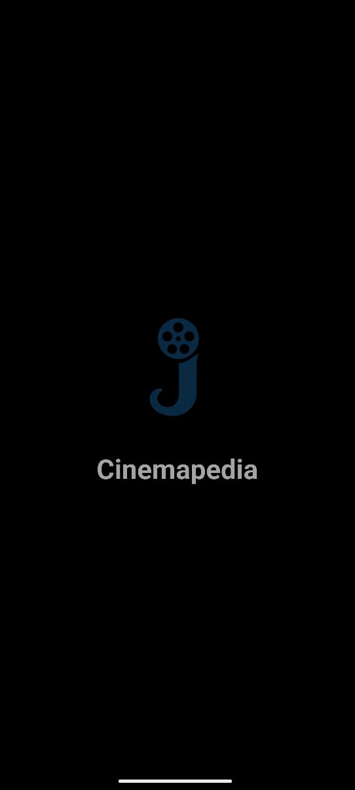
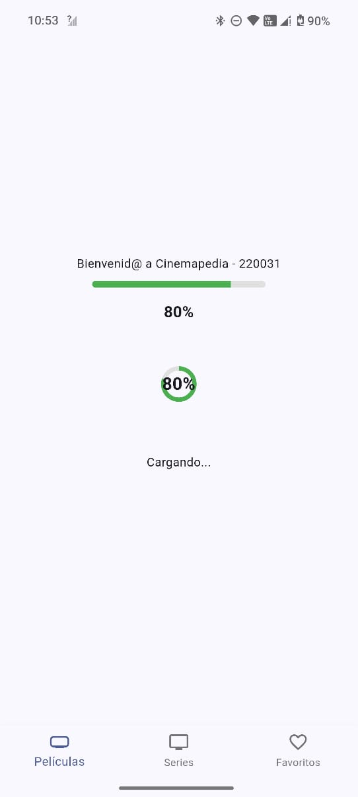
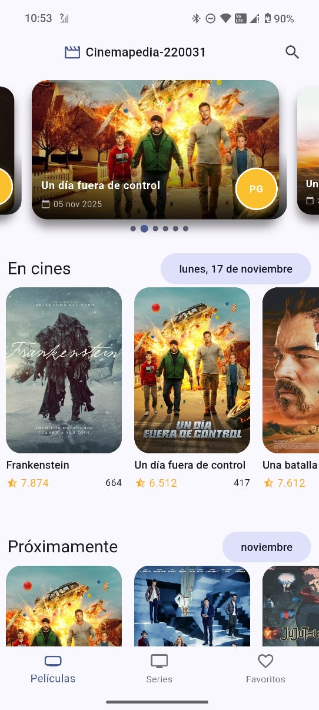
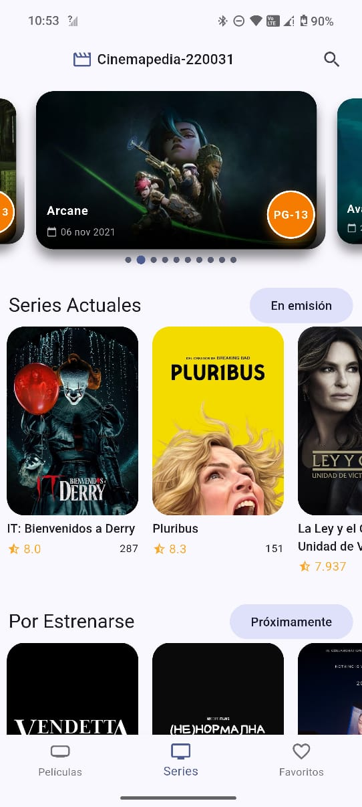

# Examen Práctico Unidad 2  
**Asignatura:** Desarrollo Móvil Integral  
**Proyecto:** Aplicación *Cinemapedia*  

---

##  1. Contexto

El proyecto <strong>Cinemapedia</strong> es una aplicación móvil desarrollada en <strong>Flutter</strong> con el objetivo de aprender y practicar el consumo de <strong>APIs</strong>. La aplicación permite mostrar información actualizada sobre películas en cartelera, próximas a estrenarse, populares, mejor calificadas y mexicanas, obtenidas desde una API externa.  

Actualmente, se está implementando esta misma funcionalidad para <strong>series</strong>, permitiendo consultar y visualizar contenido televisivo con una estructura similar a la de las películas.

---

##  2. Información General del Estudiante
- **Nombre completo:** Jaime Vazquez Santiago 
- **Matrícula:**  220031 
- **Grupo:** B  
- **Repositorio privado:** [https://github.com/Jaimevs/DMI_ExamenPractico_U2_220031](#)  
- **Versión actual:** `v1.0-examen`  
- **Último commit registrado:**  

## 3. Actividades Desarrolladas Durante la Contingencia

| Fecha | Actividad | Descripción breve | Evidencia | Commit ID |
|:------|:-----------|:------------------|:-----------|:-----------|
| 08/11/2025 | Creación del repositorio | Se cargó la práctica base y se configuró la API TMDB. | 743ce1f (HEAD -> main, origin/main) first commit | 743ce1f |
| 09/11/2025 | Implementación del Splash Screen | Se creó la carpeta `audio` y dentro de `screens/splash` se agregó `splash_screen.dart` usando `just_audio` para animación y audio. | d977227 ExamenPractico | d977227 |
| 10/11/2025 | Pantalla de carga progresiva | Se añadió un indicador de carga animado que muestra el progreso mientras se cargan los providers. | bbc3ead ExamenPractico | bbc3ead |
| 11/11/2025 | Ajustes visuales en Swiper | Se agregó clasificación visual y detalles en el carrusel de películas. | aa2c15b ExamenPractico | aa2c15b |
| 11/11/2025 | Personalización del ícono de la app | Se reemplazó el ícono predeterminado por uno personalizado usando `flutter_launcher_icons`. | d80c8e9 ExamenPractico | d80c8e9 |
| 17/11/2025 | Ajustes en Películas Actuales | Se agregó **fecha dinámica actual** (día de la semana, día y mes) en la sección *Now Playing*. | f5106d3 feat: mejorar secciones de películas | f5106d3 |
| 17/11/2025 | Ajustes en Próximos Estrenos | Se filtraron los *Upcoming* para mostrar solo los del mes y año vigentes y se sustituyó popularidad y promedio por la **fecha de estreno**. | f5106d3 feat: mejorar secciones de películas | f5106d3 |
| 17/11/2025 | Ajustes en Películas Populares | Se eliminó el subtítulo de la sección *Popular*. | f5106d3 feat: mejorar secciones de películas | f5106d3 |
| 17/11/2025 | Ordenamiento de Películas Mexicanas | Se ordenaron las películas mexicanas por **fecha de estreno descendente**. | f5106d3 feat: mejorar secciones de películas | f5106d3 |
| 17/11/2025 | Implementación del módulo de Series | Se agregó la arquitectura completa: entidad Series, datasources, repositorios, modelos, mappers, providers, listas y Swiper. | 47ebaea feat: implementar módulo de Series | 47ebaea |
| 17/11/2025 | Estructura para Series (Domain + Infra) | Se agregó capa *domain* e *infrastructure* para manejar series en la misma arquitectura que películas. | 934748b feat: agregar capa domain para Series | 934748b |
| 17/11/2025 | Pantallas de detalle (Series y Películas) | Se implementaron pantallas completas de detalle: información, géneros, sinopsis, actores, animaciones, providers por ID. | 356a09a feat: agregar pantallas de detalle | 356a09a |

   
  <em><strong>Figura 1:</strong> Evidencia de la creación del repositorio en GitHub</em>

   
  <em><strong>Figura 2:</strong> Evidencia de la personalización del ícono en la app Flutter.</em>

  

     
    <em><strong>Figura 3:</strong> Pantalla de carga inicial con el logo de la app.</em>
  

  

     
    <em><strong>Figura 4:</strong> Animación con audio en el Splash Screen usando `just_audio`.</em>
  

  

     
    <em><strong>Figura 5:</strong> Carrusel de películas antes de agregar clasificación visual y detalles.</em>
  

  

     
    <em><strong>Figura 6:</strong> Carrusel de películas después de agregar clasificación visual y detalles con píldora de color.</em>
  

   
  <em><strong>Figura 7:</strong> Indicador de carga animado durante la inicialización de la app.</em>

   
  <em><strong>Figura 8:</strong> Películas actuales mostrando la fecha dinámica del dispositivo.</em>

   
  <em><strong>Figura 9:</strong> Sección 'Upcoming' mostrando solo estrenos del mes y año vigentes.</em>

   
  <em><strong>Figura 10:</strong> Películas populares sin subtítulo adicional en la sección.</em>

   
  <em><strong>Figura 11:</strong> Películas mexicanas ordenadas por fecha de estreno descendente.</em>

   
  <em><strong>Figura 12:</strong> Swiper con el Top 10 de series.</em>

   
  <em><strong>Figura 13:</strong> Listas infinitas de Series Actuales, Próximas, Populares y Mejor Valoradas.</em>

   
  <em><strong>Figura 14:</strong> Pantalla de detalles con géneros, sinopsis, actores y diseño avanzado.</em>

---

## 4. Historial de Commits Relevantes

| Commit | Mensaje | Fecha |
|:--------|:----------|:-------|
| `356a09a` | feat: agregar pantallas de detalle para películas y series | 17/11/2025 |
| `7b77d79` | feat: agregar detalles completos de película, actores e información adicional | 17/11/2025 |
| `1779b19` | feat: implementación de tarjetas con datos principales de película | 17/11/2025 |
| `f5106d3` | feat: mejorar secciones de películas (actuales, próximas, populares y mexicanas) | 17/11/2025 |
| `47ebaea` | feat: implementar módulo completo de Series (entidad, screens, widgets y rutas) | 17/11/2025 |
| `3b51bfc` | feat: arquitectura completa para Series (models, mappers, providers) | 17/11/2025 |
| `934748b` | feat: agregar capa domain e infrastructure del módulo Series | 17/11/2025 |
| `bbc3ead` | feat: Animated Splash Screen con audio + indicador de carga progresivo | 12/11/2025 |
| `aa2c15b` | feat: agregar clasificación visual y detalles en el carrusel de películas | 11/11/2025 |
| `d977227` | feat: creación de carpeta audio + pantalla Splash Screen con `just_audio` | 11/11/2025 |
| `d80c8e9` | feat: creación de ícono personalizado usando `flutter_launcher_icons` | 11/11/2025 |
| `f3241a2` | docs: creación del README y documentación inicial del proyecto | 11/11/2025 |

---

###  Commit principal (mayor aporte al proyecto)

#### `356a09a` – **feat: agregar pantallas de detalle para películas y series**

Este commit incluye:

- Información detallada de cada contenido  
- Póster, géneros, sinopsis y calificación  
- Listado de actores con imagen y personaje  
- Consultas dinámicas a la API por ID  
- Nuevos modelos y mappers para manejo de datos  
- Providers para obtener detalle individual  
- Diseño mejorado con gradientes y animaciones  
- Pantallas completas para Películas y Series

---

## 5. Evidencias Visuales

| Evidencia              | Descripción                                                                 | Imagen                                                |
|------------------------|-----------------------------------------------------------------------------|------------------------------------------------------|
| Splash Screen          | Animación inicial con logo, efecto FadeIn/ZoomIn y reproductor de audio     |  |
| Loading Screen         | Indicador porcentual de carga (0-100%) con barra de progreso animada        |  |
| Swiper Principal       | Muestra título, fecha de estreno y píldora de clasificación con sombreado   |  |
| Categorías de Series   | Vista detallada mostrando los diferentes grupos de series organizados por categoría con ratings y posters |  |

## 6. Uso de Inteligencia Artificial

Documentacion: https://drive.google.com/file/d/1uIY6B4COQ1PMYIvZKEH9avWBJu7qjXEW/view?usp=sharing

---

## 💬 8. Conclusión Personal

Durante el desarrollo de Cinemapedia 220031, aprendí la importancia de una arquitectura clara con separación de capas (domain, infrastructure, presentation) y cómo los providers de Riverpod facilitan la gestión de estado compleja. La parte más desafiante fue implementar correctamente los mappers para convertir datos de la API en entidades del dominio, especialmente al manejar valores nulos y rutas de imágenes inválidas. Con ayuda de la IA logré implementar funcionalidades avanzadas como pantallas de detalles dinámicas, filtrado de películas por mes, ordenamiento de series mexicanas, y un sistema completo de actores integrado. Para la entrega final, me propongo refinar la experiencia visual con transiciones más suaves, optimizar las consultas a API para reducir carga de datos innecesarios, e implementar un sistema de favoritos persistente con base de datos local.

---

## 🧠 9. Reflexión sobre el Aprendizaje

Esta práctica ha consolidado mi comprensión del desarrollo móvil integral con Flutter al demostrar cómo integrar múltiples capas arquitectónicas en una aplicación real. Trabajar con la API de TheMovieDB me permitió entender la importancia de manejar correctamente los datos externos: validar respuestas, mapear estructuras JSON a entidades del dominio, y manejar casos donde faltan datos o URLs son inválidas. 

La implementación de patrones como clean architecture con datasources, repositories y providers de Riverpod mostró cómo mantener el código escalable y testeable. Aprendí que la separación de responsabilidades no es solo teoría, sino fundamental para agregar features sin romper lo existente (como agregar series mexicanas ordenadas, o implementar pantallas de detalles sin afectar el listado principal).

El mayor aprendizaje fue comprender el flujo completo: desde solicitar datos a la API → mapear a modelos → persistir en providers → renderizar en widgets. También entendí la importancia de la experiencia del usuario: mostrar loaders, manejar errores gracefully, y usar animaciones para transiciones suaves.

Esta práctica me preparó para desarrollar aplicaciones reales que consumen APIs públicas, entienden arquitectura escalable, y brindan experiencias fluidas al usuario. Para futuros proyectos, aplicaré estos principios enfocándome en optimización de red (caché local) y persistencia de datos offline.

---

